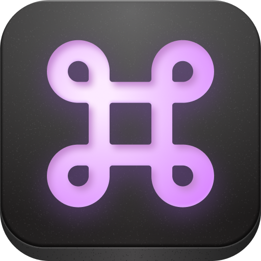
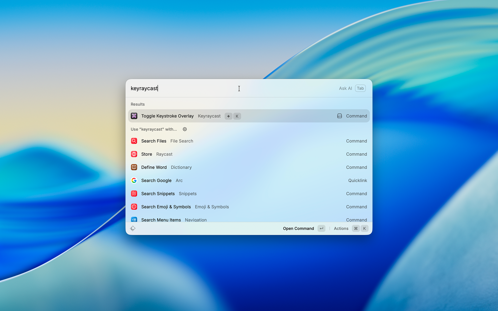
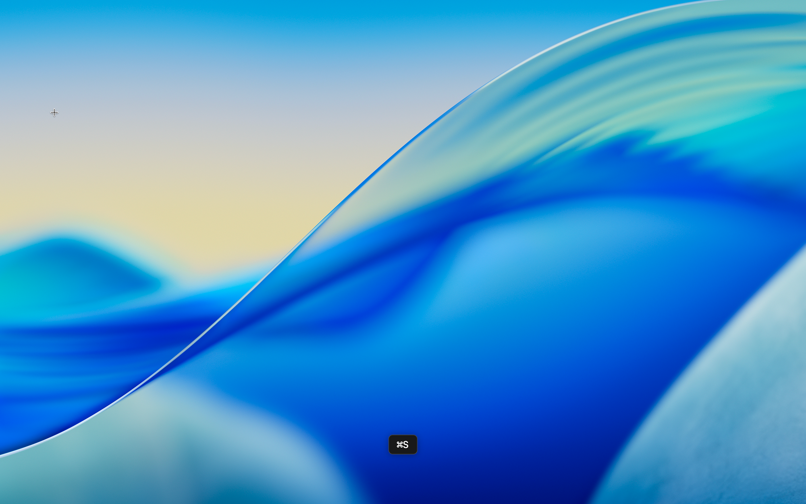

  

<h1 align="center">KeyRaycast</h1>

  Show keystrokes on screen. A modern <a href="https://github.com/keycastr/keycastr">KeyCastr</a> alternative as a Raycast extension.
   
  Great for screen recordings, live demos, presentations, and bug reports.

## Features

- **Three display modes** — All Keys, All Modified Keys, or Command Keys Only
- **Mouse click visualization** — Shows modifier+clicks and right-clicks
- **Multi-monitor support** — Overlay follows your cursor across screens
- **Appearance themes** — Dark, Light, Auto (match system), or Liquid Glass (macOS 26+)
- **Configurable position** — Six positions (top/bottom, left/center/right)
- **Adjustable timing** — Display duration from 0.5s to 5.0s
- **International keyboard support** — Correct character display for all layouts
- **Smart pill grouping** — Continuous typing collapses into one pill, shortcuts get their own

## Setup

1. Install the extension from the Raycast Store
2. Run **Toggle Keystroke Overlay** from Raycast
3. Grant **Accessibility** permission when prompted (System Settings > Privacy & Security > Accessibility)
4. Toggle again to start the overlay

### Accessibility Permission

KeyRaycast uses a macOS CGEventTap to capture keystrokes. This requires Accessibility permission. The first time you run it, macOS will prompt you to grant access. If the overlay doesn't appear, check System Settings > Privacy & Security > Accessibility and make sure Raycast (or the KeyraycastHelper) is enabled.

## Settings

Change settings in Raycast preferences. Toggle the overlay off then on to apply changes.

| Setting           | Options                                        | Default       |
| ----------------- | ---------------------------------------------- | ------------- |
| Display Mode      | All Keys, All Modified Keys, Command Keys Only | All Keys      |
| Display Duration  | 0.5s, 1.0s, 1.5s, 2.0s, 3.0s, 5.0s             | 2.0s          |
| Appearance        | Auto, Glass (macOS 26+), Dark, Light           | Auto          |
| Font Size         | Extra Small, Small, Medium, Large, Extra Large | Medium        |
| Position          | Bottom/Top + Center/Left/Right                 | Bottom Center |
| Force Uppercase   | On/Off                                         | Off           |
| Show Space Symbol | On/Off                                         | On            |
| Show Mouse Clicks | On/Off                                         | Off           |

## Preview

|                                                                        |                                                                      |
| ---------------------------------------------------------------------- | -------------------------------------------------------------------- |
|  _Toggle command in Raycast_ |  _Typed text with light theme_ |
|  _Liquid Glass on macOS 26_      |  _Shortcuts with dark theme_    |

## How It Works

The Raycast extension launches a native Swift helper binary that runs independently in the background. The helper captures keystrokes via CGEventTap and displays them in a floating overlay window. Toggling off sends SIGTERM to the helper process.

The overlay runs in a separate long-lived Swift process (`KeyraycastHelper`) with its own `NSApplication` loop, so **`swift/keyraycast-helper/`** is a plain SPM executable. The directory layout (`swift/<target>/`) follows extensions like [color-picker](https://github.com/raycast/extensions/tree/HEAD/extensions/color-picker/swift), but we don't link `extensions-swift-tools`/`@raycast` macros — they're meant for short-lived Swift functions called via `swift:` imports, which would add a heavy `swift-syntax` build for no benefit here.

`KeyraycastHelper` is **not** committed to git. Build it with:

- `npm run build-helper` — fast, host arch only (good for `npm run dev`, runs automatically before it).
- `npm run build-helper-universal` — universal `arm64 + x86_64`, used by `npm run build` for distribution.
